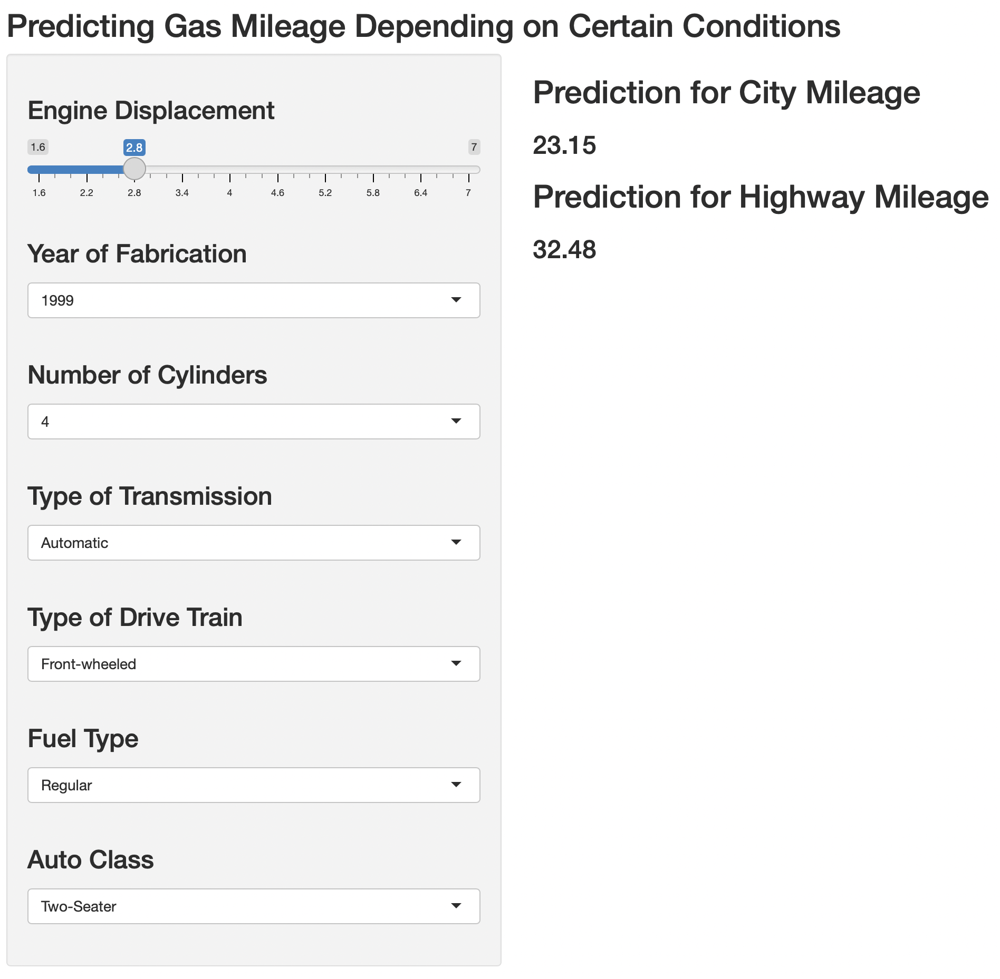

```{r setup, include=FALSE}
knitr::opts_chunk$set(echo = FALSE)
```

## Introduction

This is a presentation required for the Course Project for the Developing Data Products course in Coursera.

Preview of the application:

{width=50%}

## Overview

- This application was made in R using the Shiny package.
- It takes 7 different variables and fits two linear models to predict the gas mileage in the city and in highways.
- There are two types of inputs: a slider and six drop down menus.
- server.R includes the backend calculation of the web app.
- ui.R includes the code needed to render the UI elements in HTML.

The data used was the "mpg" library from the "ggplot2" package:

```{r}
library(ggplot2)
head(mpg)
```


## Parts of the Application

Side Panel

- Choose the desired engine displacement
- Select the year of fabrication, number of cylinders, type of transmission, drive train and fuel and the class of the car.

Main Panel

- Display both predicted gas mileages

## Try the Application

[Shiny App](https://jhonitmon.shinyapps.io/DDP_Course_Project/)

[Github Repo](https://github.com/jhonitmon/Developing-Data-Products-Course-Project)

Thank you for reading!
